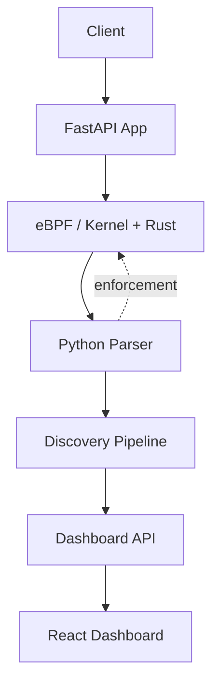
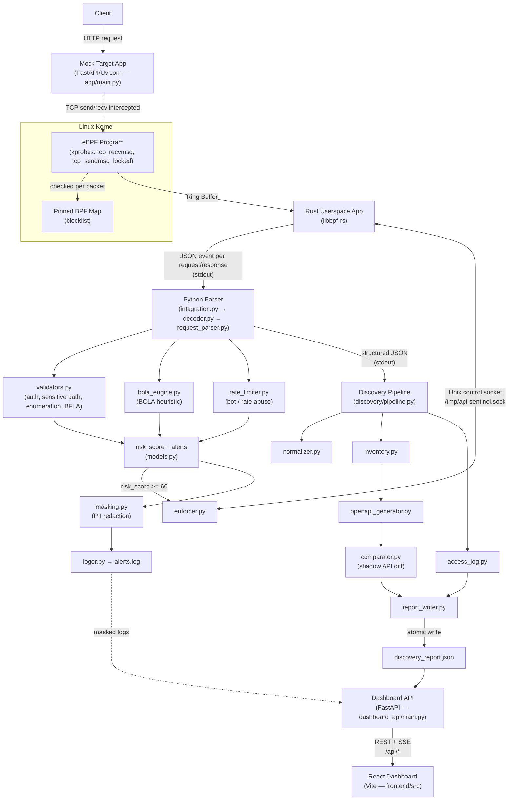

# API-Sentinel

End-to-end flow from a raw client request to what renders on the React dashboard.

---

## Simple Overview

- Correct order: **Client → FastAPI App → eBPF/Kernel+Rust → Parser → Discovery → Dashboard API → React**.
- The dotted line is the one loop-back in the system: the parser can tell the eBPF layer to block a flow.

---

## Detailed Diagram

- Full description of what every module in this diagram does lives in its own doc, linked above — not repeated here.

---

## Key Design Points

- Traffic is only observed; enforcement is a deliberate, narrow action (single flow, time-limited TTL) triggered only past the risk threshold.
- The `discovery_report.json` decouples the detection pipeline from the dashboard; the API layer never needs to know how detection works internally.
- Enumeration, BOLA, BFLA, and rate abuse are independent detectors that can and do overlap (e.g. `bola_engine.py` also catches non-sequential ID enumeration that `check_enumeration()` alone would miss).
- Masking happens before logging, not after.