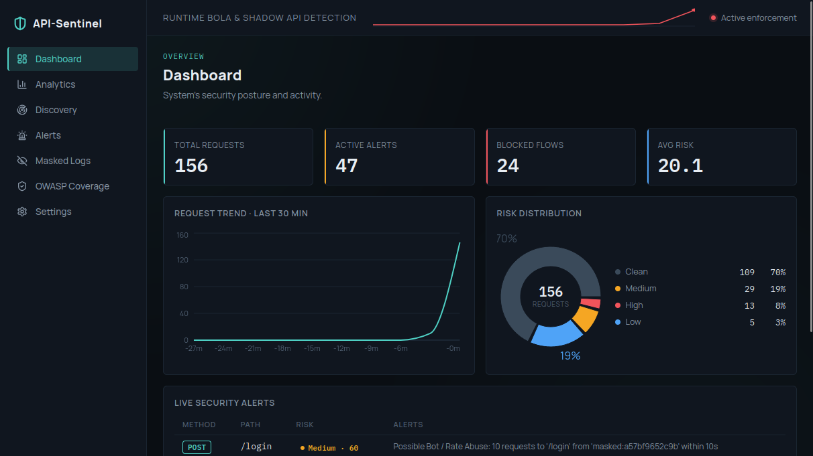
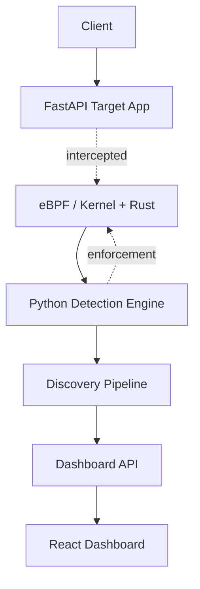
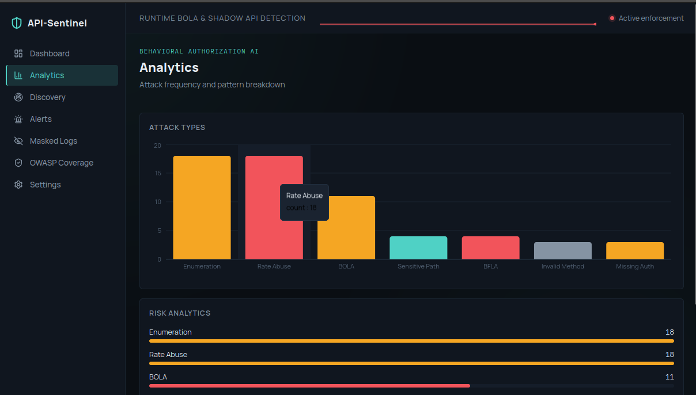
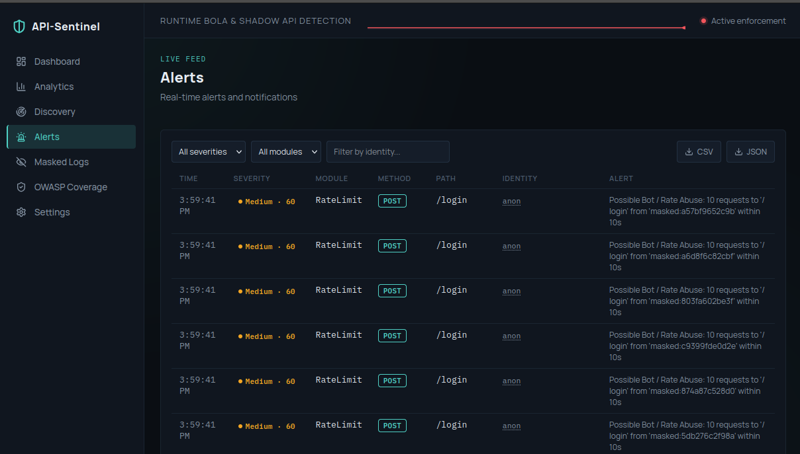
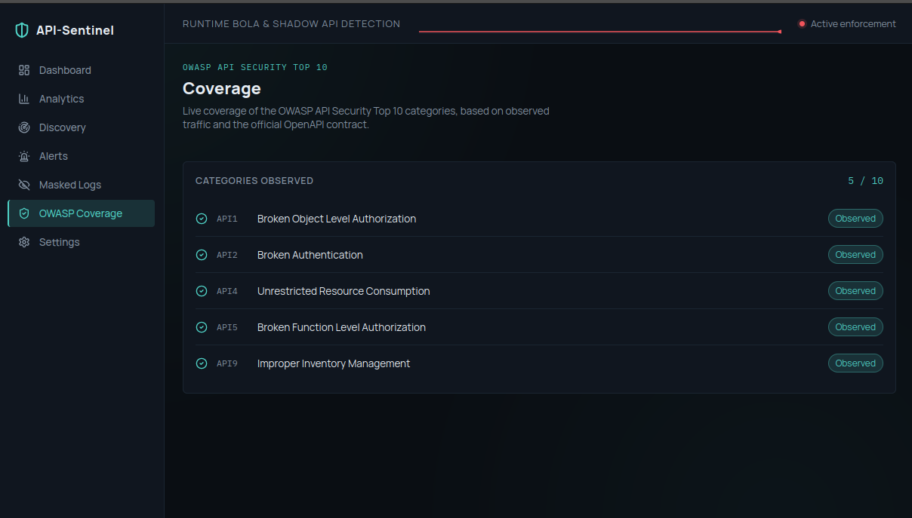
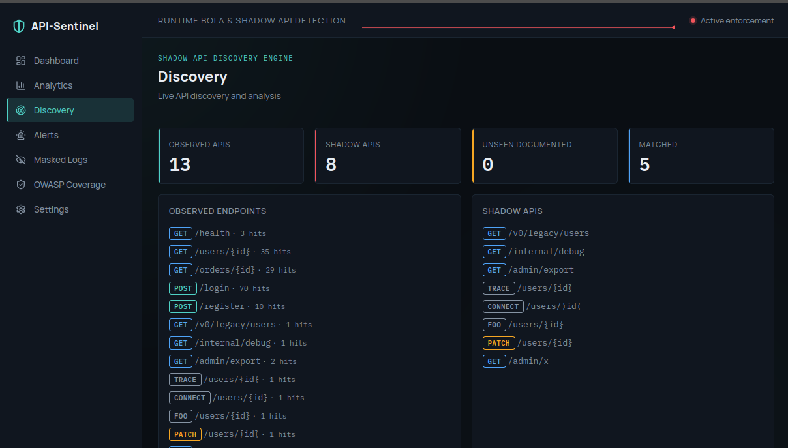

<div align="center">

# 🛡️ API-Sentinel

**Runtime BOLA & Shadow API Detection Engine**

[](https://www.python.org/)
[](https://www.rust-lang.org/)
[](https://fastapi.tiangolo.com/)
[](https://react.dev/)

<br>


<p align="center">
  
</p>

</div>

---

## Overview

- **API-Sentinel** is a runtime API security engine that watches traffic at the kernel level using
  eBPF, reconstructing every HTTP request outside the application entirely, with no middleware, SDK,
  or code changes required.
- **The issue:** traditional WAFs are built to catch malformed or malicious payloads. They have no
  concept of authorization logic, so a fully authenticated, syntactically valid request that quietly
  accesses another user's data sails through without a single alert.
- **Why it matters:** because of the following gap, API-Sentinel is built specifically to catch what WAFs miss,
  BOLA, enumeration, BFLA, bot/rate abuse, and undocumented shadow APIs, in real time, with the ability
  to block the offending flow directly at the kernel level instead of just logging it.

## Features

- Kernel-level traffic capture via eBPF
- BOLA (Broken Object Level Authorization) detection
- Shadow API discovery
- Enumeration, rate/bot abuse, and BFLA detection
- Real kernel-level enforcement
- PII masking
- Live dashboard with real-time alerts
- OWASP API Top 10 mapping

## Architecture



Each stage of this pipeline (capture, detection, discovery, and enforcement) is documented fully
in [`Documentation`](Documentation).

## Dashboard Pages

| Page | Description |
|---|---|
| Dashboard | Real-time system overview: total requests, active alerts, and risk distribution at a glance. |
| Analytics | Attack pattern and rate, classified live from the engine's own alerts. |
| Discovery | Live posture, computed directly from the discovery report. Nothing hardcoded. |
| Alerts | Every request the detection engine has flagged as suspicious, streamed live and sorted newest first. |
| Masked Logs | Full request detail with PII already redacted before it reaches the dashboard. |
| Settings | Read-only. Live engine configuration. |

## Screenshots

<table>
<tr>
<td width="50%"></td>
<td width="50%"></td>
</tr>
<tr>
<td width="50%"></td>
<td width="50%"></td>
</tr>
</table>

## Tech Stack

| Layer | Technology |
|---|---|
| Kernel capture | eBPF (kprobes, ring buffer, pinned BPF map) |
| Userspace loader | Rust, `libbpf-rs` |
| Detection engine | Python |
| Backend API | FastAPI, Uvicorn |
| Dashboard | React, Vite, Recharts |
| Target app | FastAPI |

## Performance

Measured with ApacheBench (`-n 1000 -c 10`) at the mid-project review checkpoint, comparing the
baseline FastAPI app against the same endpoints with API-Sentinel's eBPF capture and detection
pipeline active. Target: under 5 ms added latency per request.

| Endpoint | Baseline | With API-Sentinel | Overhead | Result |
|---|---|---|---|---|
| `GET /users/{id}` | 11.428 ms | 15.576 ms | 4.148 ms | Pass |
| `GET /orders/{id}` | 13.035 ms | 15.779 ms | 2.744 ms | Pass |
| `POST /login` | 13.498 ms | 13.851 ms | 0.353 ms | Pass |
| `POST /register` | 10.665 ms | 15.474 ms | 4.809 ms | Pass |

All endpoints stayed under the 5 ms overhead target under the workload.

## Project Structure

Full setup, including prerequisites, dependency installation, and the exact run sequence across all
four services, is documented in **[PROCEDURE.md](PROCEDURE.md)**.

```
API-Sentinel/
├── backend/       FastAPI app + detection engine
├── ebpf/          Rust + eBPF capture/enforcement
├── frontend/      React dashboard
├── tests/         Test harness
└── Documentation/ Design docs
```

## Documentation

- [`Documentation/Architecture.md`](Documentation/Architecture.md): full system design and data flow
- [`Documentation/(1) Traffic Interception.md`](<Documentation/(1) Traffic Interception.md>): the eBPF/Rust capture layer
- [`Documentation/(2) Python Parser and Detection Engine.md`](<Documentation/(2) Python Parser and Detection Engine.md>): the detection engine
- [`Documentation/(3) Discovery Pipeline.md`](<Documentation/(3) Discovery Pipeline.md>): shadow API discovery

## License

 
This project is **proprietary** and not open source. It was developed as part of the
**Axlero Solutions Internship Program**. All rights are reserved.
